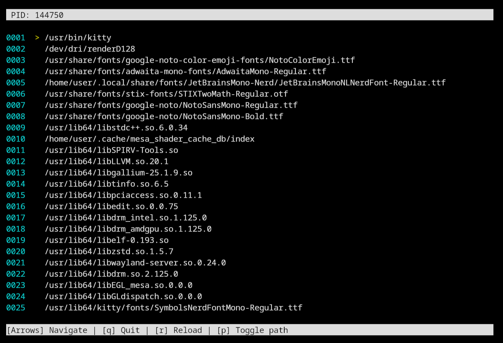

# 🛠️ MemDumper  

**MemDumper** is an utility for analyzing Linux process memory using the native /proc/ interface. It provides an interactive view of memory maps and loaded libraries.



## ✨ Features
- 🖥️ Interactive ncurses interface
- 📊 Structured memory map visualization
- 🎨 Color scheme
- 📁 Keyboard navigation support

## 📦 Prerequisites
- Linux system (kernel 4.4+)
- Ncurses library

## 🚀 Prerequisites
```bash
# Clone the repository
git clone https://github.com/ItalianG0urmet/linux-process-dumper-gui.git
cd linux-process-dumper-gui

# Compile the project
mkdir build
cd build
cmake ..
make

# Run the application
./dumper -p <PID> [-f <filter>]
```
## 🕹️ Usage
| Option  | Description                | 	Example                 |
|---------|----------------------------|--------------------------|
| `-p`    | 	Specify the target PID    | `-p 1234`               |
| `-f`    |   Filter results (optional) | `-f "libc"`             |
| `-a`    |   Show full path (optional) | `-a`                    |
